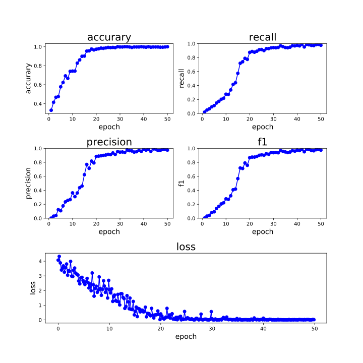
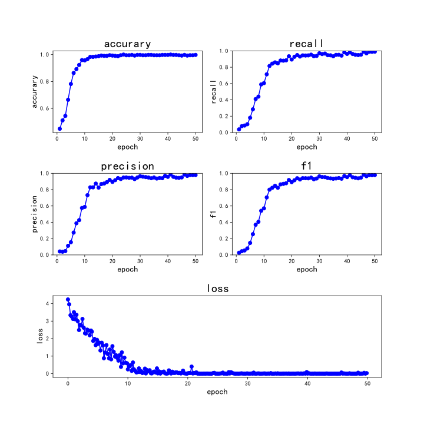
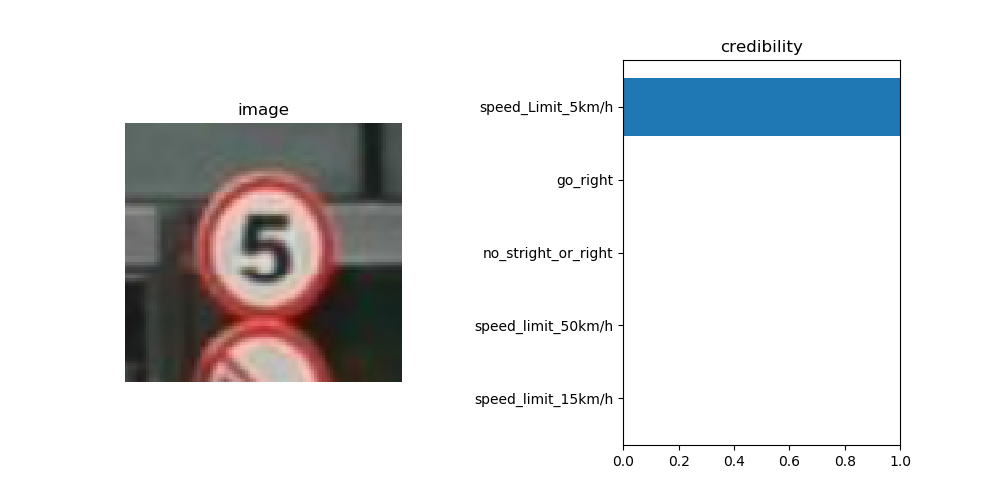

# 基于 ResNet 的交通标识分类
## 网络
模型使用 ResNet50

## 数据集
数据来源于 [Chinese Traffic Sign Database](http://www.nlpr.ia.ac.cn/pal/trafficdata/recognition.html)

共 4170 张训练图片，1994 张测试图片，58 个类别

数据集很小，而且分类数量不均衡，最少的一类只有 2 张训练图片

将训练和测试文件夹下的 `label.txt` 文件改为 `path label` 的格式

## 模型数据

|准确率|精确|召回|f1|
|--|--|--|--|
|92%|0.9784|0.9902|0.9781|

AdamW 优化器 0.01 lr：

SGD 优化器 0.01 lr：

测试结果：

